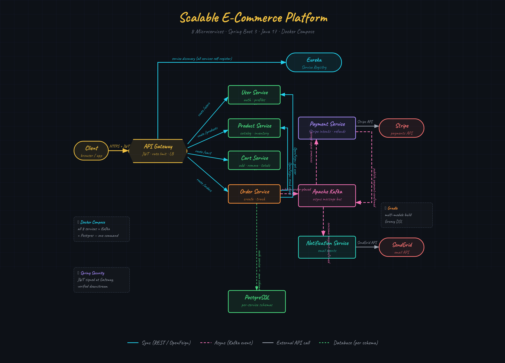

# E-Commerce Microservices Platform

### UI


### Architecture


### UML


### Database Schema


### Swagger API


## Table of Contents
- [Overview](#0-overview)
- [Usage](#1-usage)
- [Project Structure](#2-project-structure)

---

## Overview

Developed an end-to-end e-commerce platform using a microservices' architecture using 
Java, Spring Boot and Spring Cloud orchestrated via Docker Compose, and built with Gradle.
The system is composed of 8 independent microservices covering user authentication,
product catalog, shopping cart, order management, payment processing, and email notifications.

Services communicate synchronously via OpenFeign (REST) and asynchronously via Apache Kafka.
All services register with a central Eureka discovery server and are exposed to clients through
a single Spring Cloud Gateway that handles JWT validation and load balancing/rate limiting.

1. `Spring Cloud Gateway` - single entry point for all client traffic; handles JWT auth filter, rate limiting per IP, and Eureka-backed load-balanced routing to downstream services
2. `Eureka Service Registry` - register services on startup and the gateway resolves hostnames dynamically without hardcoded URLs
3. `OpenFeign` - declarative HTTP client for synchronous inter-service calls between services
4. `Apache Kafka` - async event bus for the order lifecycle; topics `order-placed` and `payment-confirmed`
5. `Stripe Java SDK` - payment intent creation, webhook signature verification, and refund issuance
6. `SendGrid Java SDK` - transactional email delivery for order and payment confirmations
7. `PostgreSQL` - one shared Postgres instance with per-service schemas for isolation

---

### Prerequisites
- JDK 21
- Docker Desktop
- IntelliJ IDEA Ultimate
- Gradle

### Run

**Step 1 - Open the project and Set up the JDK**

Go to **File → Project Structure → Project**, set SDK to JDK 21 and language level to 17.

**Step 2 - Set up infrastructure in Terminal**

```bash
docker compose up -d postgres zookeeper kafka discovery-server
```

Verify all four are healthy before proceeding:
```bash
docker compose ps
```

Eureka dashboard: `http://localhost:8761`

**Step 3 - Create Run Configurations**

Go to **Run → Edit Configurations → + → Spring Boot** and create one configuration per service:

| Service                |
|------------------------|
| `user-service`         |
| `product-service`      |
| `cart-service`         |
| `order-service`        |
| `payment-service`      | 
| `notification-service` |
| `api-gateway`          |

**Step 4 - Run services in order**

Start services in this sequence, waiting ~10 seconds between each:

```
1. user-service
2. product-service
3. cart-service
4. order-service
5. payment-service
6. notification-service
7. api-gateway
```

Watch the Eureka dashboard at `http://localhost:8761` - services appear as they register.

**Step 5 - Verify**

```bash
# Health check
GET http://localhost:8080/actuator/health

# Register a user
POST http://localhost:8080/api/auth/register
Content-Type: application/json

{
  "email": "test@example.com",
  "password": "password123",
  "first_name": "Test",
  "last_name": "User"
}
```

A successful registration returns a JWT token. Use it as `Bearer <token>` for all subsequent requests.

#### Service Ports

| Service                | Port  | Responsibility                                    |
|------------------------|-------|---------------------------------------------------|
| `api-gateway`          | 8080  | Routing, JWT validation, rate limiting            |
| `discovery-server`     | 8761  | Eureka service registry                           |
| `user-service`         | 8081  | Registration, JWT issuance, profile management    |
| `product-service`      | 8082  | Catalog, categories, inventory tracking           |
| `cart-service`         | 8083  | Cart CRUD, item quantities, scheduled cart expiry |
| `order-service`        | 8084  | Order lifecycle, Kafka producer/consumer          |
| `payment-service`      | 8085  | Stripe charges, refunds, webhook handling         |
| `notification-service` | 8086  | SendGrid email, Kafka consumer                    |

Each service is an independent subproject with its own `build.gradle`, `Dockerfile`, and `application.yml`.
Shared dependency versions are declared once in the root `build.gradle` via Spring Boot.